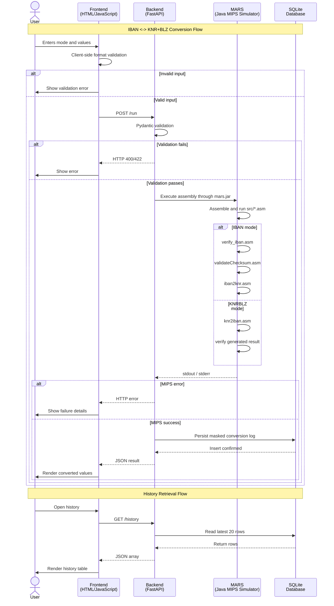

# MIPS German IBAN Converter

A full-stack engineering project that converts between German IBANs and their underlying bank identifiers using a MIPS assembly core, a FastAPI execution layer, a browser frontend, and SQLite-backed history deployed on DigitalOcean.

The interesting part of this repo is that the business logic is not reimplemented in Python or JavaScript. The backend validates and orchestrates requests, but the actual conversion and checksum logic executes inside MARS against the assembly modules in [`src/`](./src).

## What It Does

- Validates and parses German IBANs (`IBAN -> KNR + BLZ`).
- Generates German IBANs from account metadata (`KNR + BLZ -> IBAN`).
- Runs the conversion logic through MIPS assembly via `mars.jar`.
- Exposes the workflow through a FastAPI API and static frontend.
- Persists masked conversion history to SQLite.
- Includes assembly-level, backend, and frontend-oriented tests.
- Deployed via Docker on DigitalOcean.

## Architecture & Design

- **MIPS-first approach**: Core banking logic lives in low-level assembly, not reimplemented in Python or JavaScript. MARS is the source of truth for conversions.
- **Layered architecture**: Frontend validates UX, backend validates security (Pydantic), MIPS assembly executes domain logic. Each layer owns its responsibility.
- **Production practices**: Deterministic testing across assembly, backend, and frontend; containerized execution for reproducibility; security controls include validation, masked persistence, rate limiting, and parameterized SQL queries.

### Stack

- `src/*.asm`: MIPS assembly implementation of IBAN verification, checksum validation, and conversion.
- `mars.jar`: Java-based MIPS simulator used to assemble and execute the assembly programs.
- `backend/main.py`: FastAPI app, request validation, MARS process execution, response parsing, and rate limiting.
- `backend/db.py`: SQLite initialization and conversion-history persistence.
- `frontend/`: Static HTML/CSS/JavaScript UI.
- `tests/` and `test_*.py`: Assembly reference tests plus Python backend/frontend tests.

### Execution Flow

1. The user selects a mode in the browser: `IBAN` or `KNRBLZ`.
2. The frontend performs lightweight format validation.
3. The frontend sends `POST /run` to the FastAPI backend.
4. The backend validates the payload with Pydantic.
5. The backend invokes `java -jar /app/mars.jar` with the assembly modules.
6. The MIPS program returns either `OK` with parsed fields or `ERR` with a message.
7. The backend parses the output, masks sensitive values for persistence, and returns JSON to the frontend.
8. The frontend renders the result and can fetch recent history from `GET /history`.

### Sequence Diagram

The following diagram is integrated from [`sequenceDiagram.txt`](./sequenceDiagram.txt) and captures the main request lifecycle:



## Repo Layout

```
└── 📁MIPS NEW FOLDER
    └── 📁.github
        └── 📁workflows
            ├── ci_backend.yml
            ├── ci_frontend.yml
            ├── ci.yml
    └── 📁backend
        ├── __init__.py
        ├── db.py
        ├── main.py
    └── 📁data
    └── 📁frontend
        ├── history.html
        ├── history.js
        ├── index.html
        ├── script.js
        ├── style.css
    └── 📁src
        ├── iban2knr.asm
        ├── knr2iban.asm
        ├── main.asm
        ├── moduloStr.asm
        ├── util.asm
        ├── validateChecksum.asm
        ├── verify_iban.asm
    └── 📁tests
        └── 📁test
            ├── test_iban2knr_1.asm
            ├── test_iban2knr_1.ref
            ├── test_iban2knr_mem_1.asm
            ├── test_iban2knr_mem_1.ref
            ├── test_knr2iban_1.asm
            ├── test_knr2iban_1.ref
            ├── test_moduloStr_1.asm
            ├── test_moduloStr_1.ref
            ├── test_validateChecksum.asm
            ├── test_validateChecksum.ref
    ├── .dockerignore
    ├── .env
    ├── .gitignore
    ├── docker-compose.yml
    ├── Dockerfile
    ├── LICENSE
    ├── mars
    ├── mars.jar
    ├── README.md
    ├── requirements.txt
    ├── run_tests.py
    ├── sequenceDiagram.txt
    ├── test_backend.py
    └── test_frontend.py
```

## MIPS Modules

- `main.asm`: top-level control flow and stdin/stdout interaction
- `verify_iban.asm`: country/prefix-oriented validation for German IBAN handling
- `validateChecksum.asm`: checksum verification logic
- `iban2knr.asm`: extracts `KNR` and `BLZ` from a valid IBAN
- `knr2iban.asm`: generates a valid IBAN from `KNR` and `BLZ`
- `moduloStr.asm`: string-based modulo arithmetic used for checksum computation
- `util.asm`: shared helpers

## API Surface

### `POST /run`

Converts either:

- `IBAN -> KNR + BLZ`
- `KNR + BLZ -> IBAN`

Example request:

```json
{
  "mode": "IBAN",
  "value1": "DE44500105171234567890"
}
```

Example response:

```json
{
  "status_msg": "Valid checksum! This is a valid IBAN!",
  "result": {
    "BLZ": "50010517",
    "KNR": "1234567890"
  }
}
```

### `GET /history`

Returns the 20 most recent masked conversion records stored in SQLite.

## Validation and Safety

- Frontend validation catches obvious formatting mistakes before a network call.
- Backend validation uses Pydantic to enforce allowed modes and exact field formats.
- SlowAPI rate limiting protects `POST /run` and `GET /history`.
- Sensitive values are masked before persistence.
- SQLite writes use parameterized queries in `backend/db.py`.

## Running Locally

### Option 1: Docker Compose

```bash
docker compose up --build
```

Then open:

- `http://localhost:8000/`

### Option 2: Local Python Environment

Requirements:

- Python 3
- Java 17+ recommended for `mars.jar`

Install dependencies:

```bash
pip install -r requirements.txt
```

Run the API:

```bash
uvicorn backend.main:app --host 0.0.0.0 --port 8000
```

Open:

- `http://localhost:8000/`

## Environment Variables

- `PORT`: FastAPI port, defaults to `8000`
- `ALLOWED_ORIGINS`: comma-separated CORS allowlist
- `MIPS_TIMEOUT`: execution timeout for MARS subprocesses, defaults to `10`
- `DATABASE_PATH`: SQLite file path, defaults to `data/history.db`

## Testing

### Assembly Reference Tests

Runs MARS against the assembly test cases under `tests/test` and compares output with `.ref` files.

```bash
python run_tests.py
```

### Backend Tests

Mocks MARS process execution and verifies request validation and API behavior.

```bash
pytest test_backend.py
```

### Frontend Validation Tests

Executes JavaScript validation logic through `PyExecJS`.

```bash
pytest test_frontend.py
```

### Full Python Test Pass

```bash
pytest
```

## Continuous Integration

GitHub Actions is used for CI and runs automatically on every push to `main` and on every pull request.

The workflows are defined in [`.github/workflows/`](./.github/workflows):

- `ci.yml`: runs the MIPS assembly reference suite with `python run_tests.py`
- `ci_backend.yml`: runs backend API tests with `python -m pytest test_backend.py -v`
- `ci_frontend.yml`: runs frontend validation tests with `python -m pytest test_frontend.py -v`

Each workflow runs on `ubuntu-latest`, checks out the repo, sets up Python `3.11`, installs dependencies from `requirements.txt`, and executes the relevant test target.

## Deployment Notes

The container image:

- starts from `eclipse-temurin:17-jre`
- installs Python and runtime dependencies
- copies `mars.jar`, assembly sources, backend, and frontend assets
- launches `uvicorn backend.main:app`

The Compose file also provisions:

- port mapping
- persistent volume storage for the SQLite database
- a health check against `/`

## Known Constraints

- The current implementation is focused on German IBANs.
- MARS execution is process-based, so throughput is bounded by simulator startup and runtime.
- History currently stores the most recent 20 rows when queried.

## License

This project is distributed under the terms of the [`LICENSE`](./LICENSE) file.
